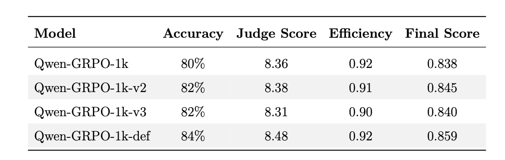
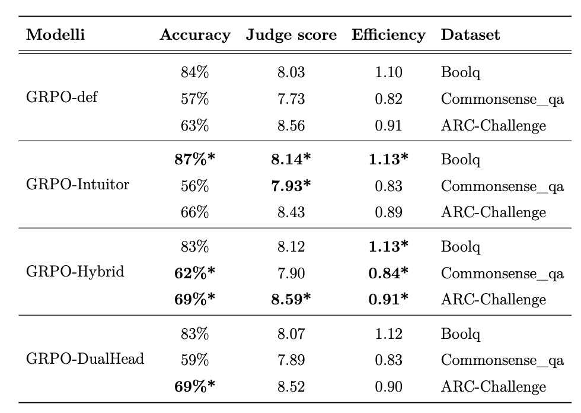
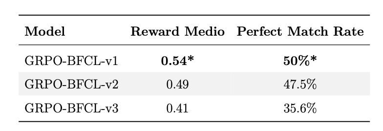

# Improving Reasoning and Generalization in LLM Through a Hybrid Reward approach with GRPO
This thesis investigates the use of Group-Relative Policy Optimization (GRPO) to improve reasoning and generalization in large language models through a novel reward approach based on both internal (intrinsic) and external feedback. Starting from a model trained with Supervised Fine-Tuning (SFT), we apply GRPO as an additional reinforcement learning step to encourage more robust and comparative learning behaviors. Through experimental analysis, we study how GRPO affects model accuracy, robustness, and generalization, while also discussing the impact of non-optimal hyperparameters and early experimental configurations. We compare our approach with state-of-the-art approaches, finding that in out-of-domain tests, our technique significantly outperforms the others.

## Execution Pipeline
1. Enviroment Setup
2. SFT Train
3. GRPO_indomain / GRPO_outdomain
4. BFCL

## Environment Setup
1. Create and activate conda enviroment
```bash
conda create -p <path-of-enviroment> python=3.10 -y
conda init bash
exec bash
conda activate <path-of-enviroment>
```
2. Install dependencies:
```bash
pip install -r ~/requirements.txt
```

## SFT Train
1. Download train dataset:
```bash
cd ~/SFT
python dataset_creation.py
```
2. SFT train:
```bash
python SFT_train.py
```
## GRPO Train
Here we can choose beetwen different approaches, hyperparameters or reward functions. All the model are trained with the same dataset. GRPO_indomain are model specifically designed and tested for better performances in in-domain evaluation and the best one is the GRPO-1K-def.py.
GRPO_outdomain are model designed to perform well in out-domain tests, the best one is GRPO-Hybrid.py.
The implementation details are described inside each python file.
In the tables below, we present a comparison among the different models.

<div align="center">
  
</div>

<div align="center">
  
</div>

- In-Domain Train
```bash
cd ~/GRPO_indomain
python GRPO-1K-def.py
```

- Out-Domain Train
```bash
cd ~/GRPO_outdomain
python GRPO-Hybrid.py
```
- GRPO test
```bash
cd ~/GRPO_indomain
python GRPO_test.py
```

## BFCL Train
Here we have 2 different train approaches GRPO_Hybrid_BFCL.py and GRPO_noHybrid_BFCL.py. The two model undergoes through the same training but the difference is that the first one start from the GRPO-Hybrid.py model and the second one from the GRPO-1k-def.py model
In the table below we compared them:

<div align="center">
  
</div>

- Dataset Creation
```bash
cd ~/BFCL
python BFCL_dataset_creation.py
```
- BFCL train
```bash
python GRPO_Hybrid_BFCL.py
```

- BFCL evaluation
```bash
python GRPO_BFCL_evaluate.py
```
